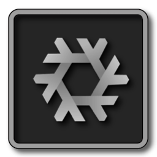

# Linux_Square_Grey
 

#### View ➥ [IconSet](https://github.com/chris1111/Linux_Square_Grey/blob/Master/View-Set.md)

### Download ➥ [Release IconSet](https://github.com/chris1111/Linux_Square_Grey/releases/tag/IconSet)

Other Linux Icons  ➤ [Linux_Android_Icons](https://github.com/chris1111/Linux_Android_Icons) ➤ [Linux-Logo-LineForm](https://github.com/chris1111/Linux-Logo-LineForm) ➥ [Purple_Ring_Linux_Logo](https://github.com/chris1111/Purple_Ring_Linux_Logo) 

➥ [Linux-Logo-Black-White](https://github.com/chris1111/Linux-Logo-Black-White) ➤ [Linux-Logo-Blue-Grey](https://github.com/chris1111/Linux-Logo-Blue-Grey)